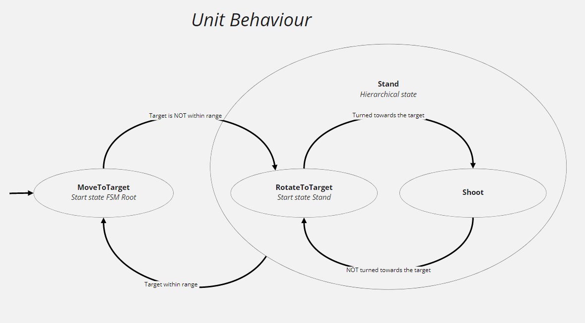

# FSM for Unity
A lightweight user-friendly finite state machine to easily implement both simple and complex behaviors.
Supports hierarchical states, custom and conditional transitions.

> Tested on unity 2020.3 and contains assembly definition for compiling to separate assembly file for performance reason.

# Table of content
* [Installation](#installation)
    * [As unity module](#as-unity-module)
    * [As source](#as-source)
* [Integration to startup](#integration-to-startup)
* [Main parts of FSM](#main-parts-of-fsm)
    * [State](#state)
    * [Transition](#transition)
    * [StateHierarchical](#statehierarchical)
* [Debug](#debug)
* [License](#license)

# Installation

> Important! Requires installed [Conditions](https://github.com/GoodCatGames/Conditions.git)

## As unity module
This repository can be installed as unity module directly from git url. In this way new line should be added to `Packages/manifest.json`:
```
"com.goodcat.fsm": "https://github.com/GoodCatGames/FSM.git"
```

## As source
If you can't / don't want to use unity modules, code can be downloaded as sources archive from `Releases` page.

# Integration to startup



```csharp
public class Unit : MonoBehaviour, IUnit
{
   ...
   public FSM Fsm { get; private set; }
   private void Awake()
    {
        const string stateStandName = "Stand";

        var stateRotateToTarget = new StateRotateToTarget();
        var stateMoveToTarget = new StateMoveToTarget();
        var conditionTargetWithinRange = new ConditionTargetWithinRange(this);

        Fsm = new FSM();
        
        // States
        Fsm.StatesCollection
            .Add(stateMoveToTarget)
            .AddHierarchical(stateStandName) // Hierarchical state
                .StatesCollection // Go inside Stand state
                .Add(stateRotateToTarget)
                
                // Create StateSimple (if you don't want to create an inheritor of the State class)
                .Add("Shoot", // Name state 
                    () => Debug.Log("Shoot start!"), // OnEnableAction
                    ShootIfYouCan, // OnUpdateAction
                    () => Debug.Log("Shoot end!")) // OnDisableAction
                    
                .SetStartState(stateRotateToTarget) // Set StartState in Stand
                
            .GetParentStatesCollection() // Go back to FSM Root
            .SetStartState(stateMoveToTarget); // Set StartState in FSM Root
            
        // Transitions
        _fsm.StatesCollection.Transitions
            .From(stateMoveToTarget).ToStateHierarchical(stateStandName) // variable stateMoveToTarget is used here
            .Set(conditionTargetWithinRange)

            .FromStateHierarchical(stateStandName).To<StateMoveToTarget>() // generic StateMoveToTarget is used here
            .Set(conditionTargetWithinRange.Not())

            .StatesCollection.GetStateHierarchical(stateStandName).StatesCollection // Go inside Stand state
                .Transitions
                .From<StateRotateToTarget>().To("Shoot")
                .Set(IsLookAtTarget) // It is not necessary to create a Condition class

                .From("Shoot").To<StateRotateToTarget>()
                .Set(() => IsLookAtTarget() == false);
        
        Fsm.Initialize();
    }
    private void Update() => Fsm.Update();
    ...
}
```
```csharp
public class ConditionTargetWithinRange : ICondition
{
   private readonly IUnit _unit;
   public ConditionTargetWithinRange(IUnit unit) => _unit = unit;
   public bool IsTrue() => (_unit.TargetCurrent.position - _unit.Owner.position).sqrMagnitude < _unit.Range * _unit.Range;
}
```
```csharp
 public interface IUnit
{
   Transform Owner { get; }
   Transform TargetCurrent { get; }
   float Range { get; }
   void ShootIfYouCan();

   bool IsLookAtTarget();
}
```

# Main parts of FSM
## State
- FSM can be in one and only one State at a time (StateMoveToTarget, StateShoot, etc)
- OnEnable() - called when entering the state
- OnUpdate() - called on every call to Fsm.Update()
- OnDisable() - called when exiting the state

```csharp
// Complex state implementation
public class StateMoveToTarget : State
{
...
    protected override void OnEnable() => StartMoveAnimation();
    protected override bool OnUpdate()
    {
        // ... movement code        
        return false;
    }
    protected override void OnDisable() => EndMoveAnimation();    
}
```

```csharp
// Simple state implementation
 var stateShoot = new StateSimple("Shoot", // Name state 
            () => Debug.Log("Shoot start!"), // OnEnableAction
            () => ShootIfYouCan(), // OnUpdateAction
            () => Debug.Log("Shoot end!")); // OnDisableAction
```

```csharp
// Setting states in fsm
 Fsm.StatesCollection
      .Add(stateMoveToTarget)
      .Add(stateShoot);
```
## Transition
- There can be one and only one Transition from StateA to StateB.
- Transition is actually a condition that is checked every time Fsm.Update() is called, but before OnUpdate() of the State class is called.
- The condition can be compound.

*For example, the Transition condition from StateRotateToTarget to StateShoot:
CurrentWeaponDoesNotRequireTurningToTarget OR AlreadyLookingAtTheTarget.*

```csharp
 Fsm.StatesCollection.Transitions
    .From<StateRotateToTarget>().To<StateShoot>()
    .Set(conditionIsNeedRotateToTarget.Not().Or(conditionLookAtTarget));
```
Look [Conditions](https://github.com/GoodCatGames/Conditions.git)

## StateHierarchical
- The hierarchical state must contain other nested states.
- One of these states must be set to start.
- When transition To StateHierarchical is triggered, this starting state is entered.
- StateHierarchical can never be Fsm.StateCurrent.
- If StateCurrent is in StateHierarchical when calling Fsm.Update() transition From StateHierarchical is checked first and only then transition From StateCurrent is checked.

```csharp
Fsm.StatesCollection
     .Add(stateMoveToTarget)
     .AddHierarchical("Stand") // Hierarchical state
         .StatesCollection // Go inside Stand state
         .Add(stateRotateToTarget)
         .Add(stateShoot);
```

# Debug
1. To track the state change, just add to the GameObject with `MonoBehaviour: IFsmContainer` component `FsmDebugView: MonoBehaviour`
2. To understand why there is a transition to any state.

a) Find the condition for the transition to the state of interest to you

```csharp
      .From<StateRotateToTarget>().To<StateShoot>()
      .Set(conditionIsNeedRotateToTarget.Not().Or(conditionLookAtTarget))
```
b) Then output the results of condition checks to the console using the Conditions `Debug(…)` method.
To do this it is enough to modernize the code
```csharp
.From<StateRotateToTarget>().To<StateShoot>()
.Set(conditionIsNeedRotateToTarget.Not().Debug("conditionIsNeedRotateToTargetNot")
Or(conditionLookAtTarget).Debug("conditionLookAtTarget"))
```

Now, when making the transition from StateRotateToTarget to StateShoot, 
we will see messages in the console, for example, of the following form:
```
// Unity Log
conditionIsNeedRotateToTargetNot - False
conditionLookAtTarget - True
```
Then the transition occurred due to the conditionLookAtTarget condition.

# License
The software is released under the terms of the [MIT license](./LICENSE.md).

No personal support or any guarantees.